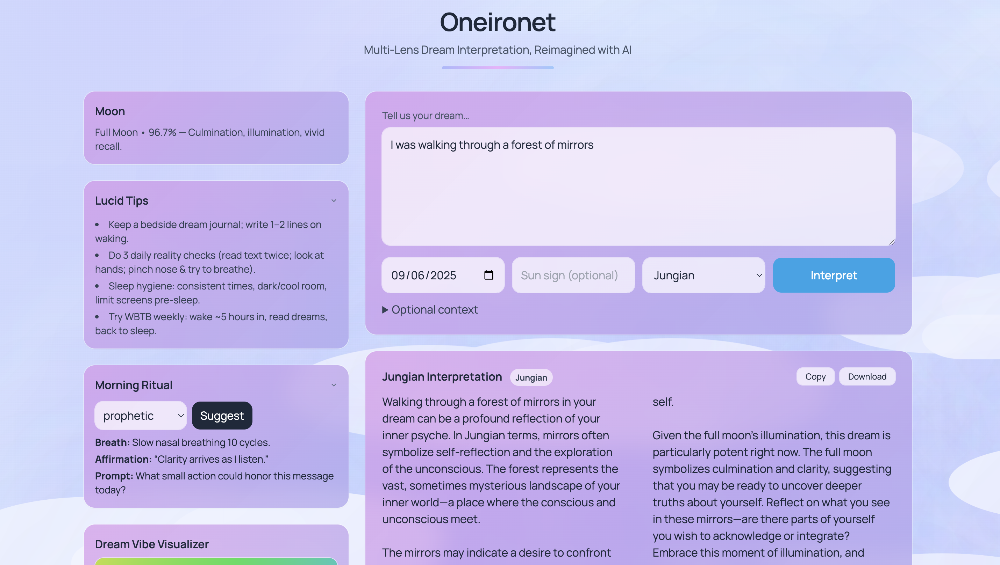
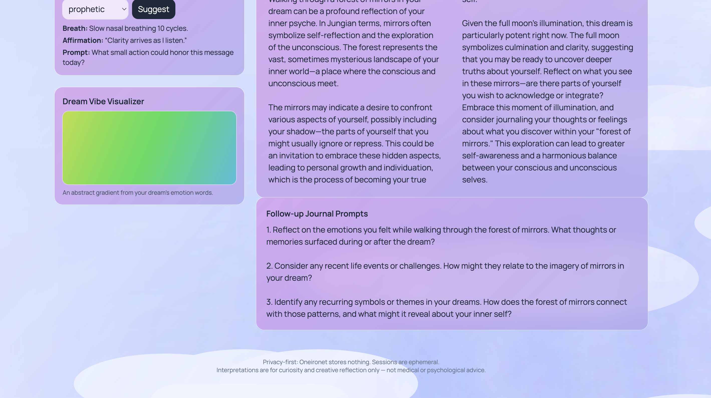

# Oneironet 🌙
Multi-Lens Dream Interpretation, Reimagined with AI.
From Jung to Vedic to Surrealist, Oneironet lets AI agents offer you multiple ways to understand your night’s journey built with **FastAPI**, **Vanilla JS + Tailwind**, and **OpenAI**.  


Oneironet allows users to record their dreams and receive diverse interpretations (Jungian, Vedic, Astrological, and Surrealist), along with moon phases, morning ritual suggestions, and lucid dreaming tips — all in a clean and super aesthetic interface hehe.

---

## Current UI ✨



---

## Features  

### 🔮 Multi-Lens Interpretation
- Jungian, Vedic, Astrologer, and Surrealist perspectives  
- Each lens gives a different symbolic reading of your dream  
- AI-powered summaries using GPT models  

### 🌙 Moon + Rituals
- Daily **moon phase** calculation with influence hints  
- **Morning ritual generator**: breathwork, affirmations, prompts  
- Built-in **lucid dreaming tips**  

### 🎨 Dream Vibe Visualizer
- Abstract gradient based on the **emotional tone** of your dream text  
- Updates dynamically as you type  

### 🖼️ Immersive UI (Tailwind + Vanta.js)
- Hero section with animated dream-like visuals  
- Glassmorphic cards and drifting clouds for atmosphere  
- Fully responsive, mobile-friendly  

### 🐳 Dockerized Architecture
- **Backend**: FastAPI with endpoints for `/interpret`, `/moonphase`, `/ritual`  
- **Frontend**: static HTML/JS with Tailwind styling + interactive canvas  
- Easy orchestration with **Docker Compose**  

---

## How to Get Started  

### 1. Clone the Repository
```bash
git clone https://github.com/HarshitaThota/Oneironet.git
cd Oneironet 
```

### 2. Install Dependencies
Backend (FastAPI):

``` bash
cd backend
pip install -r requirements.txt
```

Frontend:
Static HTML/JS — no build required.

### 3. Set Environment Variables

Copy .env.example → .env and add your keys:

OPENAI_API_KEY=your-openai-key

### 4. Run the Application

- Option A – Docker (recommended):

    docker compose up --build

    Frontend: http://localhost:8000

    Backend: http://localhost:8000/api/interpret


- Option B – Dev Mode:

Backend (FastAPI)
uvicorn app.main:app --reload --host 0.0.0.0 --port 8000

Then open index.html in your browser or serve via a local server.


---
### Usage Process

- Open http://localhost:8000

- Enter your dream in the text box (e.g., “I was walking through a forest of mirrors”)

- Choose a lens: Jungian | Vedic | Astrologer | Surrealist

- Click Interpret

- View results:

        AI-powered interpretation

        Moon phase info

        Morning ritual suggestion

        Follow-up journal prompts
---
### Built With

- OpenAI (GPT-4o / GPT-4o-mini) — Generates symbolic interpretations

- FastAPI — Backend service exposing /interpret, /moonphase, /ritual

- Tailwind CSS — Glassy UI with gradients and cards

- Vanilla JS + Canvas — Dream vibe visualizer

- Vanta.js / Three.js — Animated “dreamy” hero background

- Docker — Containerized deployment
---
### Credits

Moon phase logic adapted from open astronomy resources

Dream lexicons inspired by Jungian/astrology traditions

Visual inspiration: glassmorphism + dreamlike cloudscapes

---
### About

Your playful dream companion for symbolic, creative reflection 🌌
Disclaimer: Interpretations are for curiosity and reflection only — not medical or psychological advice.